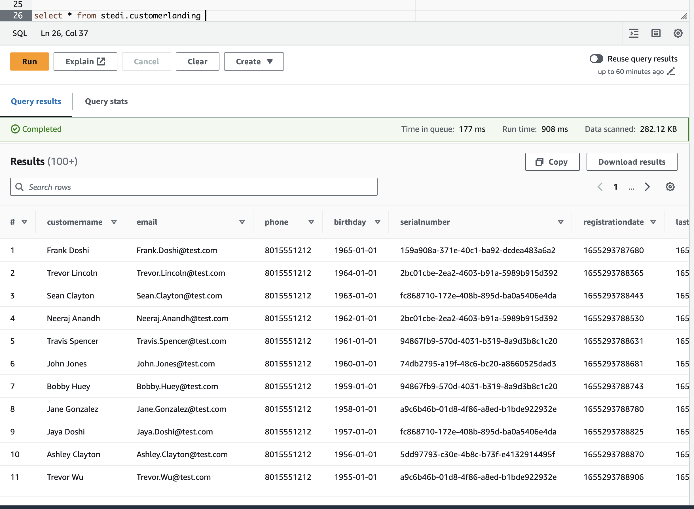
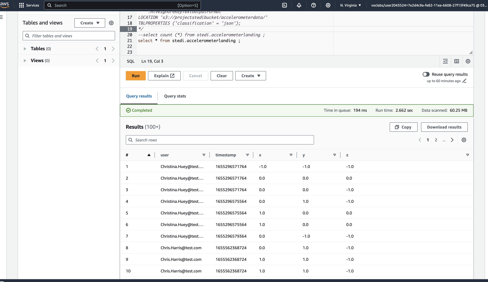
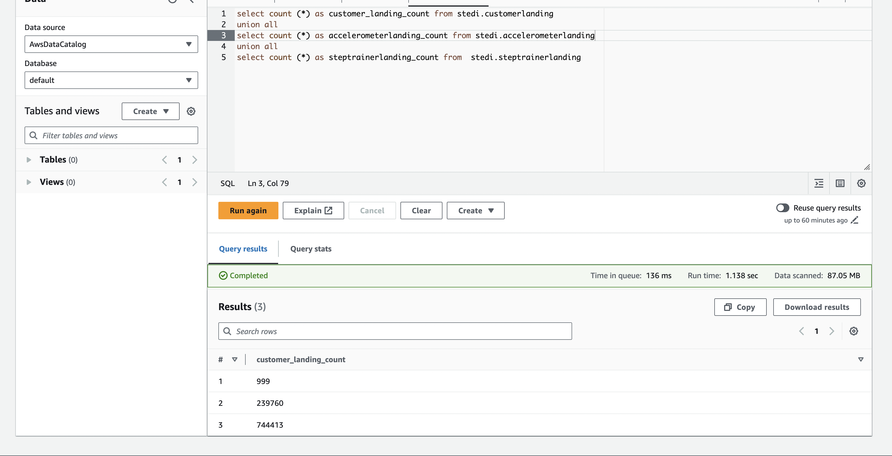
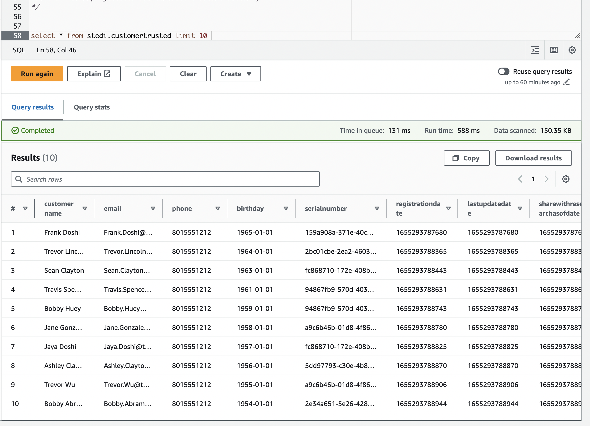
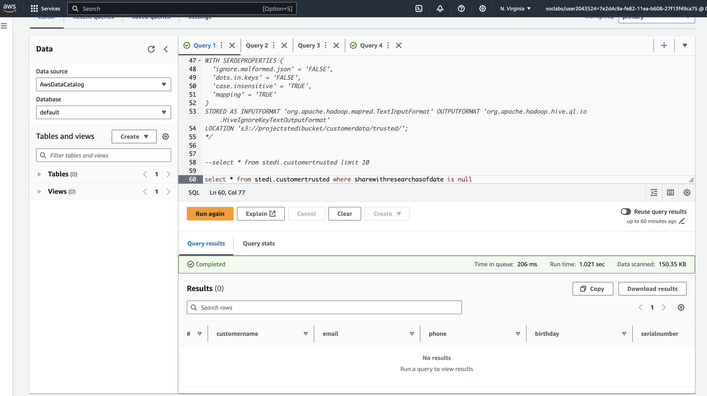

#  STEDI Human Balance Analytics Project

## Project Introduction
In this project, As a data engineer for the STEDI team, data lakehouse solution will be built for sensor data that trains a machine learning model.

## Project Details

The STEDI Team has been hard at work developing a hardware STEDI Step Trainer that:

* trains the user to do a STEDI balance exercise;
* and has sensors on the device that collect data to train a machine-learning algorithm to detect steps;
* has a companion mobile app that collects customer data and interacts with the device sensors.
STEDI has heard from millions of early adopters who are willing to purchase the STEDI Step Trainers and use them.

Several customers have already received their Step Trainers, installed the mobile application, and begun using them together to test their balance. The Step Trainer is just a motion sensor that records the distance of the object detected. The app uses a mobile phone accelerometer to detect motion in the X, Y, and Z directions.

The STEDI team wants to use the motion sensor data to train a machine learning model to detect steps accurately in real-time. Privacy will be a primary consideration in deciding what data can be used.

Some of the early adopters have agreed to share their data for research purposes. **Only these customers’ Step Trainer and accelerometer data should be used in the training data for the machine learning model.** 

## Project Data 
### 1. Customer Records** (from fulfillment and the STEDI website):

contains the following fields:

- serialnumber
- sharewithpublicasofdate
- birthday
- registrationdate
- sharewithresearchasofdate
- customername
- email
- lastupdatedate
- phone
- sharewithfriendsasofdate

### 2. Step Trainer Records (data from the motion sensor):

contains the following fields:

- sensorReadingTime
- serialNumber
- distanceFromObject

### 3. Accelerometer Records (from the mobile app):

contains the following fields:

-timeStamp
-user
-x
-y
-z

## Project Summary

### Landing Zone

_**There are two Glue tables for the two landing zones:**_ 
* [customer_landing.sql](./customer_landing.sql)
* [acceleromter_landing.sql](./acceleromter_landing.sql)

_**Below is the results (Screenshot) of select statements from Athena showing the customer landing, and accelerometer landing data:**_ 

* `customer_landing` table:

     

*  `accelerometer_landing` table: 

    

_**Below screenshot showed record count check for each landing table: **_
    

### Trusted and Curated Zone

 An IAM service Role needs to be created with grant access on the Glue Service to allow AWS Glue to to access S3 and other resources.

_**Glue Job Scripts:**_ 
* [customer_trusted.py](./customer_trusted.py)
   Sanitize the Customer data from the Website (Landing Zone) and only store the Customer Records who agreed to share their data for research purposes (Trusted Zone) - creating a Glue Table called customer_trusted.

* [accelerometer_trusted.py](./accelerometer_trusted.py)
  Sanitize the Accelerometer data from the Mobile App (Landing Zone) - and only store Accelerometer Readings from customers who agreed to share their data for research purposes (Trusted Zone) - creating a Glue Table called accelerometer_trusted.

* [customer_curated.py](./customer_curated.py)
Sanitize the Customer data (Trusted Zone) and create a Glue Table (Curated Zone) that only includes customers who have accelerometer data and have agreed to share their data for research called customers_curated.

* [step_trainer_trusted.py](./step_trainer_trusted.py)
Step Trainer trusted

* [machine_learning_curated.py](./machine_learning_curated.py)
Create an aggregated table that has each of the Step Trainer Readings, and the associated accelerometer reading data for the same timestamp, but only for customers who have agreed to share their data, and make a glue table called machine_learning_curated.

_**Use Athena to query Customer and Accelerometer Trusted Glue Tables**_ 

screenshot of customer_trusted

below screebshot shows no records where shareWithResearchAsOfDate is null 

